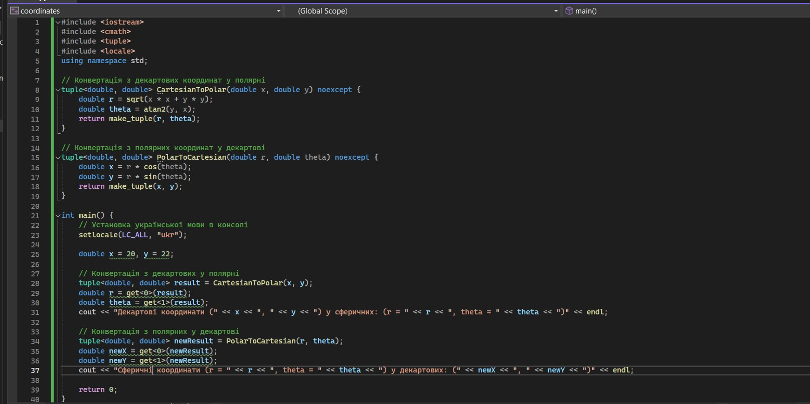
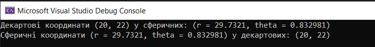
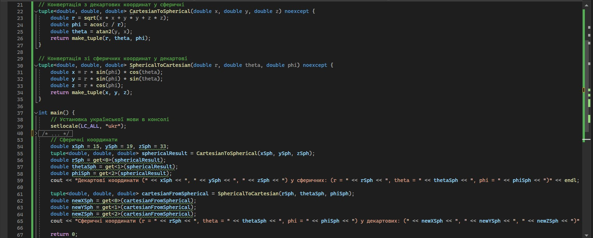
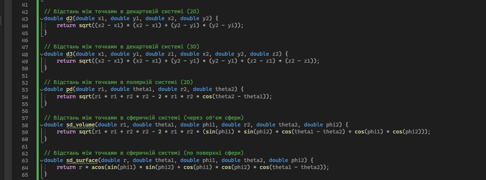
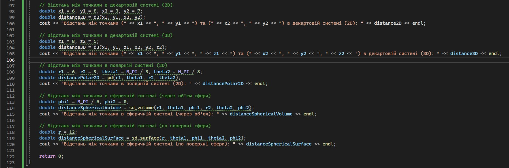
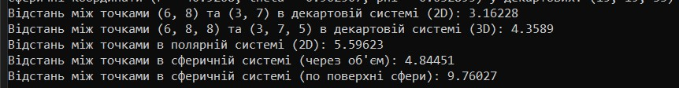
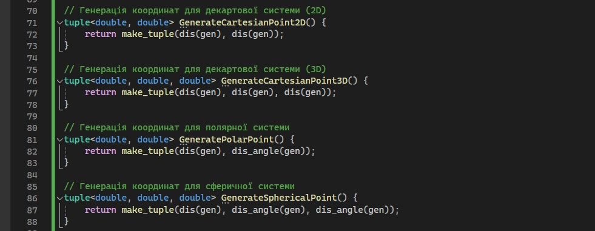
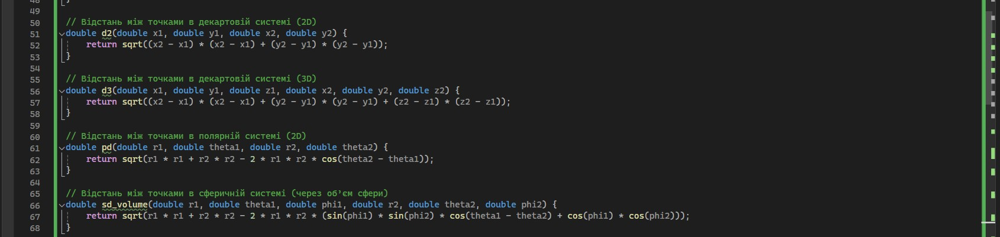
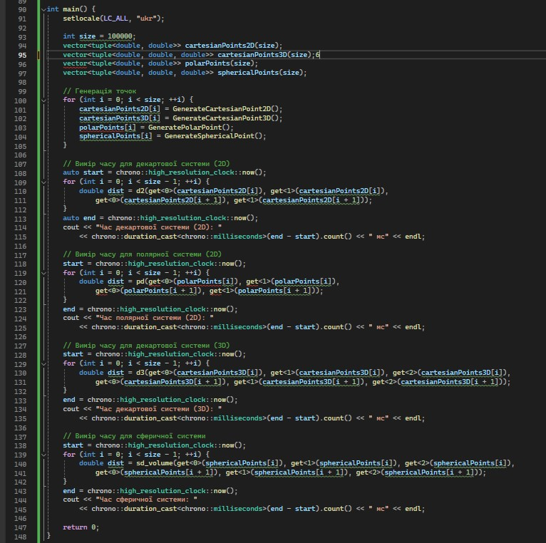

###Перехід між системами координат 
 
перехід із декартової системи координат у полярну і навпаки 

Для заданих точок у площині, представлених декартовими координатами (x, y), було проведено перехід до полярної системи координат, визначивши радіус (r) та кут (θ). Потім, використовуючи отримані полярні координати, було здійснено зворотне перетворення в декартову систему. 
 
Результат: 

 
 
перехід із декартової системи координат у сферичну і навпаки 

 
Було здійснено подвійне перетворення координат. Спочатку декартові координати точок були перетворені в сферичні за допомогою відповідних формул, що дозволило визначити радіус, азимутальний та полярний кути. Отримані сферичні координати були використані для зворотного перетворення у декартову систему, щоб перевірити коректність обчислень. 
 
Результат: 

 
 
###Розрахунок відстаней у сферичній системі координат

Програма реалізує функції для обчислення відстаней між точками в різних системах координат:
 
Декартова система: 
d2: для двовимірного простору (x, y) 
d3: для тривимірного простору (x, y, z) 
Полярна система: 
 pd - для двовимірного простору, використовуючи радіуси (r) та азимути (θ). 
Сферична система: 
sd: для обчислення відстані через об'єм сфери, використовуючи радіуси (r), азимути (θ) та полярні кути (φ). 
sd: для обчислення відстані по поверхні сфери, використовуючи радіус сфери (r), азимути (θ) та полярні кути (φ). 
 
Результат: 

 
 
###Бенчмарки продуктивності.
 
 
 
Програма генерує масиви координат для декартової (2D та 3D), полярної та сферичної систем координат. Потім вона послідовно обчислює відстані між сусідніми точками в кожному масиві, використовуючи відповідні формули. Для кожного типу обчислень вимірюється час виконання і виводиться результат.  
Результат: 
